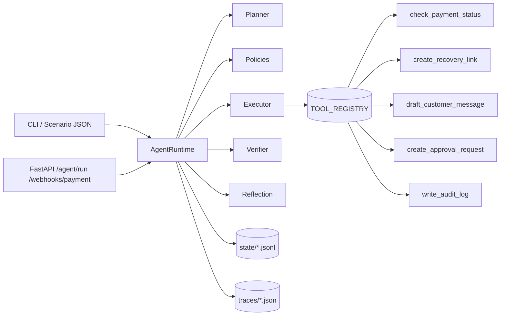

# Architecture

LedgerSoul is a small, deterministic, file-backed agent runtime wrapped by a FastAPI service.

## Components

- **FastAPI service** (`src/ledgersoul/server/api.py`, `webhooks.py`) — accepts events and exposes inspection endpoints.
- **Agent runtime** (`src/ledgersoul/agent/runtime.py`) — orchestrates the lifecycle.
- **Planner** (`planner.py`) — deterministic event-to-plan mapping.
- **Policies** (`policies.py`) — escalation and threshold rules.
- **Executor** (`executor.py`) — resolves tools through `TOOL_REGISTRY`.
- **Tool registry** (`tool_registry.py`) — tiny explicit dict.
- **Tools** (`src/ledgersoul/tools/*.py`) — mock implementations.
- **Verifier** (`verifier.py`) — checks each required tool result.
- **Reflection** (`reflection.py`) — writes structured run summary.
- **Memory** (`memory.py`) — JSON/JSONL persistence under `state/`.
- **Trace writer** (`trace.py`) — writes one JSON file per run under `traces/`.
- **Demo runner** (`src/ledgersoul/demo/run_scenario.py`) — drives scenarios from disk.

## Component Diagram



## Request Flow

1. HTTP/CLI delivers an event payload.
2. FastAPI hands the dict to `AgentRuntime.run`.
3. Runtime validates the event, checks idempotency, and routes accordingly.
4. Tools are called only via `TOOL_REGISTRY`.
5. Verifier inspects results.
6. Memory and audit log are appended.
7. Trace JSON is written.
8. `AgentRunResult` is returned to the caller.

## State Layout

```text
state/
  processed_events.jsonl    # event_id, terminal status
  audit_log.jsonl           # explicit audit entries
  memory.jsonl              # episodic notes
  pending_approvals.jsonl   # outstanding human approvals
traces/
  <event_id>-<timestamp>.json
```

## Configuration

Loaded via `src/ledgersoul/agent/config.py`:

- `AGENT_MODE` — `demo` or `service`.
- `PORT`, `STATE_DIR`, `TRACE_DIR`.
- `PAYMENT_API_MODE`, `MESSAGING_MODE` — `mock` in MVP.
- `MAX_AUTONOMOUS_AMOUNT`, `REQUIRE_HUMAN_APPROVAL`, `MAX_RETRIES`.

## Docker Deployment

- `Dockerfile` builds a slim Python 3.11 image, installs the package, and runs uvicorn.
- `docker-compose.yml` mounts `state/` and `traces/` as volumes for persistence between runs.
- Health check: `curl http://localhost:8000/health`.

## Extension Points

- Add tools by registering them in `TOOL_REGISTRY` and updating `tools.md` and the verifier.
- Replace the deterministic planner with an LLM planner behind `LLM_PROVIDER!=mock` (stretch).
- Swap JSONL storage for SQLite (stretch).
