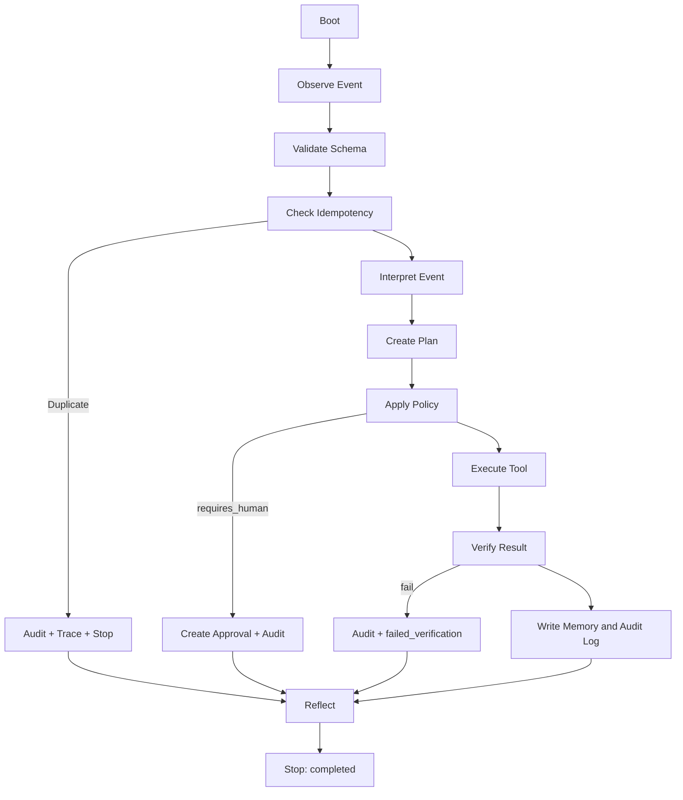

# Lifecycle

LedgerSoul executes a deterministic lifecycle for every event.

## Stages

1. **Boot** — load `soul.md`, `agent.md`, `.env`, tool registry, policy config, and prior state.
2. **Observe** — receive event from CLI scenario, `/agent/run`, or `/webhooks/payment`.
3. **Validate** — parse the event with `AgentEvent` (Pydantic). Reject malformed payloads.
4. **Idempotency Check** — query `processed_events.jsonl`. Duplicate events are routed to a no-op flow before planning.
5. **Interpret** — classify event type and risk level.
6. **Plan** — deterministic planner produces a short, inspectable `AgentPlan` with steps tied to tools.
7. **Apply Policy** — set `requires_human=True` when amount, type, or risk demands escalation.
8. **Act** — executor resolves tool names through `TOOL_REGISTRY` and runs allowed tools only.
9. **Verify** — verifier checks each required tool result; failures map to `failed_verification`.
10. **Remember** — append to `memory.jsonl`, `audit_log.jsonl`, and `pending_approvals.jsonl` as needed.
11. **Reflect** — write a structured reflection (`summary`, `confidence`, `human_required`, `next_step`).
12. **Escalate or Stop** — terminal status is one of: `completed`, `escalated`, `duplicate`, `blocked`, `failed_verification`, `error`.

## Stage Inputs and Outputs

| Stage | Input | Output |
|---|---|---|
| Boot | files, env | runtime context |
| Observe | HTTP/CLI payload | raw event dict |
| Validate | raw event | `AgentEvent` |
| Idempotency | event_id | duplicate flag |
| Interpret | event | classification, risk |
| Plan | event, classification | `AgentPlan` |
| Apply Policy | plan, config, memory | adjusted plan |
| Act | plan | `list[ToolResult]` |
| Verify | tool results | `VerificationResult` |
| Remember | results, plan | jsonl appended |
| Reflect | run state | reflection dict |
| Escalate/Stop | status | `AgentRunResult` |

## Status Contract

A run terminates with exactly one status:

- `completed` — autonomous action finished and verified.
- `escalated` — human approval requested or unknown/risky event routed for review.
- `duplicate` — event already processed; no risky tool was executed.
- `blocked` — policy blocked action without escalation.
- `failed_verification` — planned action result could not be verified.
- `error` — unexpected runtime failure. Trace is still written.

## Trace Guarantee

Every run writes exactly one trace file under `traces/<event_id>-<timestamp>.json`, including failures.

## Diagram

